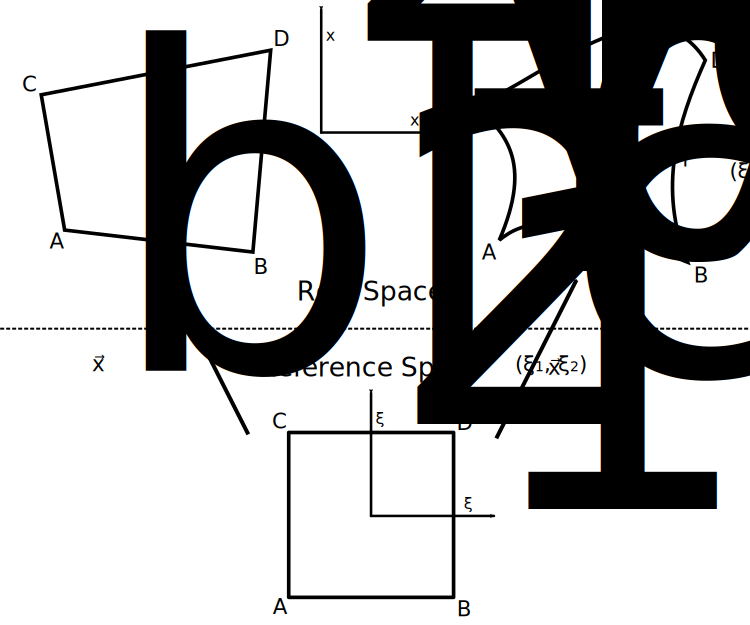

Accuracy of Mesh Representation in Nektar++
===========================================

Nektar++ supports supplying information on the curvature of edges
(line segments) and faces (triangles and quads). This is done by
specifying the coordinates of the edge/face in real space at a number
of control points. A polynomial is then used to map between
coordinates in reference-space and real-space on that geometry. The
order of this polynomial is determined by the number of control points
used and can be arbitrarily large.

Typically curved faces are only used when they are embedded in a 3D
space. If one were defining a 2D grid existing only in a 2D space then
one might make the edge of the 2D elements curved, but generally would
not bother to describe the curvature for the interior of the
face. 

2D Case
-------

         reference-space.

Consider the quad elements in the diagram above. For the upper-left
element (with straight sides), it is possible to map between reference
coordinates :math:`\xi_1, \xi_2` and real coordinates :math:`x_1, x2`
using bilinear interpolation:

.. math::
   \vec{x}_{\rm bl} = \vec{x}_A \frac{(1 -
   \xi_1)}{2}\frac{(1-\xi_2)}{2} + \vec{x}_B \frac{(1 + \xi_1)}{2}\frac{(1 -
   \xi_2)}{2} \\
   + \vec{x}_C \frac{(1 - \xi_1)}{2}\frac{(1 + \xi_2)}{2} +
   \vec{x}_D \frac{(1 + \xi_1)}{2}\frac{(1 + \xi_2)}{2}

When the edges are curved (as is the case for the upper-right element),
this expansion can be modified by the incorporation of that curvature
information:

.. math::
   \vec{x}_{\rm curve} = \vec{x}_A \frac{(1 -
   \xi_1)}{2}\frac{(1-\xi_2)}{2} + \vec{x}_B \frac{(1 + \xi_1)}{2}\frac{(1 -
   \xi_2)}{2} \\
   + \vec{x}_C \frac{(1 - \xi_1)}{2}\frac{(1 + \xi_2)}{2} +
   \vec{x}_D \frac{(1 + \xi_1)}{2}\frac{(1 + \xi_2)}{2} \\
   + \vec{g}_\alpha(\xi_1)\frac{(1 - \xi_2)}{2} +
   \vec{g}_\beta(\xi_1)\frac{(1 + \xi_2)}{2} \\
   + \vec{g}_\gamma(\xi_2)\frac{(1 - \xi_1)}{2} +
   \vec{g}_\delta(\xi_2)\frac{(1 + \xi_1)}{2}
   :label: quad_map

where

.. math::
   \vec{g}_\alpha(\xi_1) = \vec{f}_\alpha(\xi_1) - \vec{x}_A\frac{(1 - \xi_1)}{2} -
   \vec{x}_B\frac{(1+\xi_1)}{2}, \\

   \vec{g}_\beta(\xi_1) = \vec{f}_\beta(\xi_1) - \vec{x}_C\frac{(1 - \xi_1)}{2} -
   \vec{x}_D\frac{(1+\xi_1)}{2}, \\

   \vec{g}_\gamma(\xi_2) = \vec{f}_\gamma(\xi_2) - \vec{x}_A\frac{(1 - \xi_2)}{2} -
   \vec{x}_C\frac{(1+\xi_2)}{2}, \\

   \vec{g}_\delta(\xi_2) = \vec{f}_\delta(\xi_2) -
   \vec{x}_B\frac{(1-\xi_2 -)}{2} -
   \vec{x}_D\frac{(1+\xi_2)}{2}.

The functions :math:`\vec{f}` are polynomials in the reference
coordinates, meaning that the :math:`\vec{g}` functions are as
well. This expression consists of the sum of the vertex and edge modes
of the polynomial expansion of the element. Effectively, the face
modes have been assumed to have coefficients of 0. A similar technique
can be used for representing triangles, but extra care must be taken
due to the collapsed-coordinates which are used.

This approach provides a perfectly adequate means of mapping between
coordinates in reference space and real space such that the boundary
of the element will have the desired curvature. However, by setting
the coefficients of face nodes to 0 it imposes certain assumptions
about how the mapping should behave in the element interior.

When using finite difference methods in plasma physics it has been found that good
numerical results can only be achieved by using "flux-coordinate
independent" techniques. Effectively what this means is that the
coordinate system must be aligned with magnetic field lines. This
does not appear to be vital when using high-p finite element methods,
but there is some evidence that aligning elements with the magnetic field
can improve performance.

Consider Cartesian coordinates :math:`\vec{x} = [x_1, x_2]` in
real-space. If there is a magnetic field
with unit vector :math:`\hat{b}(\vec{x}) = [b_1, b_2]` (with components expressed in
real-space) then the following relationship between real and reference
coordinates will ensure the elements are field-aligned:

.. math::
   \frac{\partial x_1}{\partial \xi_1} = \alpha_1
   b_1\left(\vec{x}(\xi_1, \xi_2)\right)\\
   \frac{\partial x_2}{\partial \xi_1} = \alpha_2
   b_2\left(\vec{x}(\xi_1, \xi_2)\right)\\
   :label: alignment

where :math:`\alpha_1, \alpha_2` are constants of proportionality, determining the
overall size of the elements. Given expressions for :math:`\vec{x}(0,
\xi_2)` and :math:`\hat{b}` it would be possible to compute the
mapping between real and reference space, :math:`\vec{x}_{\rm
fa}(\xi_1,\xi_2)`, albeit it only a numerical solution may be available..

Equation :eq:`quad_map` will represent this coordinate mapping to the
desired order of accuracy if the polynomial projection of
:math:`\vec{x}_{\rm fa}` has coefficients of 0 for all face
modes. This can only be the case if

.. math::
   \vec{x}_{\rm fa}(\xi_1, \xi_2) = \vec{x}_{\rm curve}(\xi_1, \xi_2)

Examining the form of the terms in Equation :eq:`quad_map`, it can be seen that
:math:`\frac{\partial^4 \vec{x}_{\rm curve}}{\partial \xi_1^2\xi_2^2} = 0`, as do
all higher derivatives. Therefore, if 
:math:`\frac{\partial^4 \vec{x}_{\rm fa}}{\partial \xi_1^2\xi_2^2} \ne 0`
then it can not be represented to the desired order of accuracy by
Equation :eq:`quad_map`.

In a 3D tokamak simulation it is usually assumed that the magnetic
field is uniform in the toroidal direction. Take that to
correspodn to the :math:`x_1` direction. Differentiating Equation
:eq:`alignment` gives

.. math::
   \frac{\partial^2 x_i}{\partial \xi_1^2} = \alpha_i
   \frac{db_i}{dx_2}\frac{\partial x_2}{\partial\xi_1} = \alpha_i b_2
   \frac{db_1}{dx_2}

.. math::
   \frac{\partial^3 x_i}{\partial\xi_2\partial\xi_1^2} =
   \alpha_i\left(\frac{db_2}{dx_2}\frac{db_i}{dx_2} +
   b_2\frac{d^2b_i}{dx_2^2}\right)\frac{\partial x_2}{\partial\xi_2}

.. math::
   \frac{\partial^4 x_i}{\partial\xi_2^2\partial\xi_1^2} =
   \alpha_i\left(\frac{d^2b_2}{dx_x^2}\frac{db_i}{dx_2} +
   2\frac{db_2}{dx_2}\frac{d^2b_i}{dx_2^2} + b_2\frac{d^3b_i}{dx_2^3}
   \right) \left(\frac{\partial x_2}{\partial\xi_2}\right)^2 +
   \alpha_i\left(\frac{db_2}{dx_2}\frac{db_i}{dx_2} +
   b_2\frac{d^2b_i}{dx_2^2}\right)\frac{\partial x_2}{\partial\xi_2}

Although :math:`\partial x_2/\partial \xi_2` is unknown, it must be
non-zero if the coordinate transform is not degenerate. Therefore, in
general, these derivatives will be non-zero and equation
:eq:`quad_map` only provides the desired order of accuracy for the
special case with a uniform magnetic field.

A similar technique can be used to derive a more complicated
expression when :math:`\hat{b}(x_1, x_2)`. Once again, in general it
will be non-zero.

3D Case
-------

The 3D case follows essentially the same logic as the 2D case. It can
be shown that the mapping between real and reference space used by
Nektar++ will only provide the desired order of accuracy if

.. math::
   \frac{\partial^6
   \vec{x}}{\partial\xi_1^2\partial\xi_2^2\partial\xi_3^2} = 0.

Test Problem
------------

A simple 2D test problem that can be used to test the accuracy of
different meshes is one with magnetic field

.. math::
   \hat{b} = \begin{bmatrix}
       \cos\left(\theta(x_2)\right) \\
       \sin\left(\theta(x_2)\right)
   \end{bmatrix}

with

.. math::
   \theta(x_2) = \theta_0\sin\left(\frac{2n\pi}{x_{2,1} - x_{2,0}}
   x_2\right).

Here, :math:`\theta_0` indicates the magnitude of variation in the
field direction, :math:`n` represents the frequency of variation, and
:math:`x_{2,0}, x_{2, 1}` represent the lower and upper bounds in the
:math:`x_2` direction, respectively. It is recommended to keep
:math:`\theta_0\lesssim \pi/4`, to avoid introducing too much
curvature to the field-aligned coordinates.
