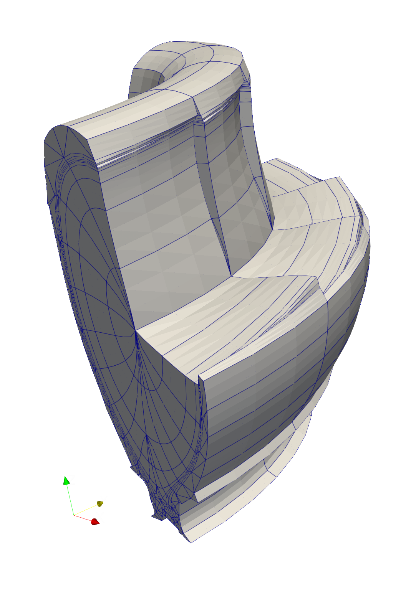

.. NESO-fame documentation master file, created by
   sphinx-quickstart on Tue Jun 27 14:52:25 2023.
   You can adapt this file completely to your liking, but it should at least
   contain the root `toctree` directive.

Welcome to NESO-fame's documentation!
=====================================

The Field-Aligned Mesh Extrusion (fame) tool generates meshes for
Tokamaks with elements aligned with magnetic field lines. Read the
:doc:`tutorial <installation>` to learn how to install and use it.

.. image:: _static/poloidal-fame.png
           :width: 350
           :alt: A poloidal mesh produced by NESO-fame with hypnotoad.

                 the field-alignment.

.. toctree::
   :maxdepth: 2
   :caption: Tutorial
   :hidden:

   installation
   simple
   tokamak
   visualisation

.. toctree::
   :maxdepth: 2
   :caption: API Reference
   :hidden:

   api

.. toctree::
   :maxdepth: 2
   :caption: Accuracy in Nektar++
   :hidden:

   accuracy
