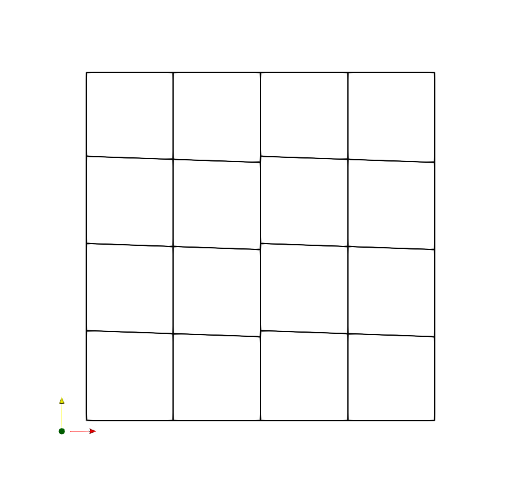
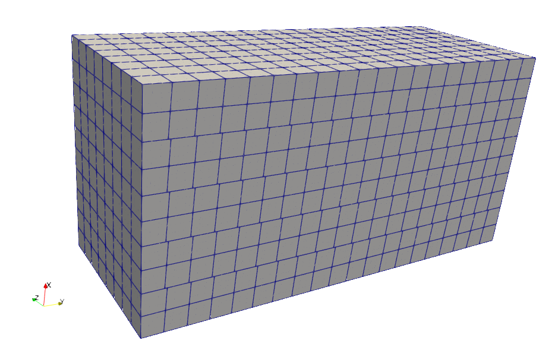

Simple Meshes
=============

You can generate simple structured meshes from the command-line using the
``fame-simple`` command. This generates either a 2D or a 3D mesh,
aligned with a straight, uniform magnetic field. By default, the field
is parallel to the x1 direction, but you can configure it to be offset
by some angle.

Your mesh is made up of "layers" in the field-aligned
direction. Elements within a layer are all conformal with each other
and all follow the direction of the magnetic field. There will be a
nonconformal interface with adjacent layers. Each layer is identical,
apart from its position on the x1-axis. Each layer may be
further subdivided along the x1 axis but, as stated above, these
elements will be conformal.

.. note::
   The python executable you call must be one that can find NekPy on
   the PYTHONPATH.

2D Meshes
---------

You can try generating a simple 10 by 10 2D mesh on the domain
:math:`x_1 \in [0, 1], x_2 \in [0, 1]`, aligned to a field shifted by
1 degree from the x1-direction, by running::
  
  fame-simple 2d --nx1 4 --nx2 4 --angle -2 simple_mesh.xml

This will save the mesh to ``simple_mesh.xml`` in the Nektar++
format. When :doc:`visualising <visualisation>` that mesh we get the
following.

By default, the number of layers in the x1-direction is the
same as the number of elements. This can be adjusted by using the
``--layers`` option. For example, if you want only two nonconformal
layers you can specify this using the ``--layers`` option::
  
  fame-simple 2d --nx1 4 --nx2 4 --angle -2 --layers 1 simple_mesh.xml

That mesh will look like the image below.

Run ``fame-simple 2d --help`` to find out about additional options for
configuring your mesh.

3D Meshes
---------
The process of generating a 3D mesh is very similar. For example, to
produce a mesh with the following properties
- 10 by 20 by 8 elements
- domain :math:`x_1 \in [0, 100], x_2 \in [0, 200], x_3 \in [0, 80]`
- aligned to a field rotate by 3 degrees away from the x1-axis and towards the x2-axis
- with 5 nonconformal layers

you should run::

  fame-simple 3d --nx1 10 --nx2 20 --nx3 8 --x1-extent 0 100 \
              --x2-extent 0 200 --x3-extent 0 80 --angle1 3 \
              --layers 5 3d_mesh.xml

This would produce the following mesh.

Again, you can get more information about the options available by
running ``fame-simple 3d --help``.
