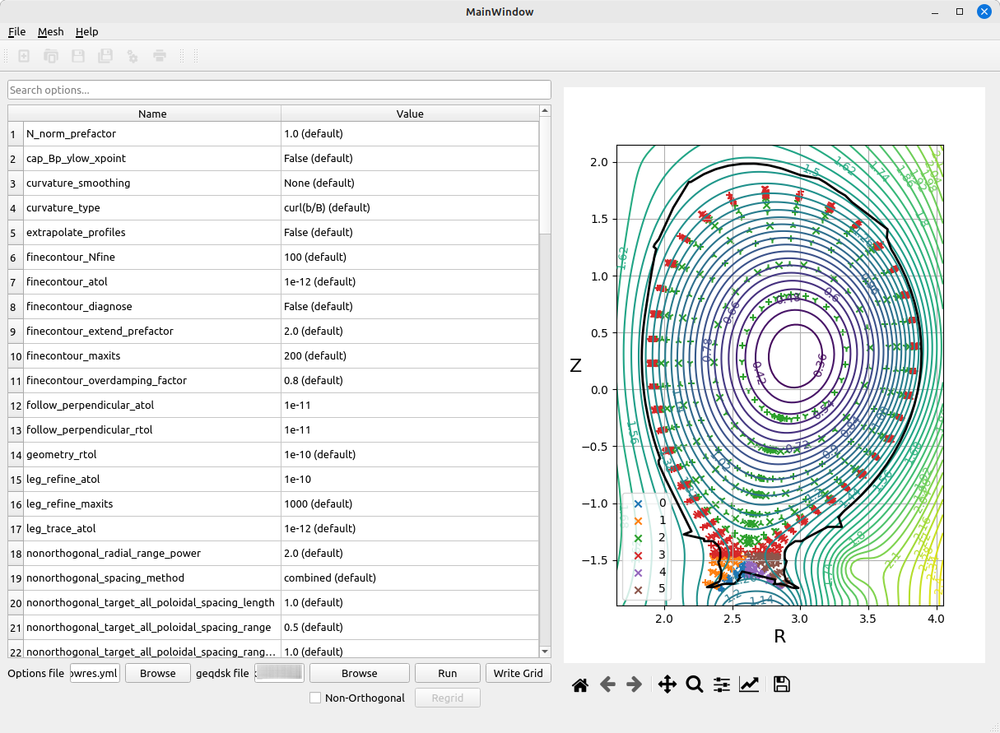
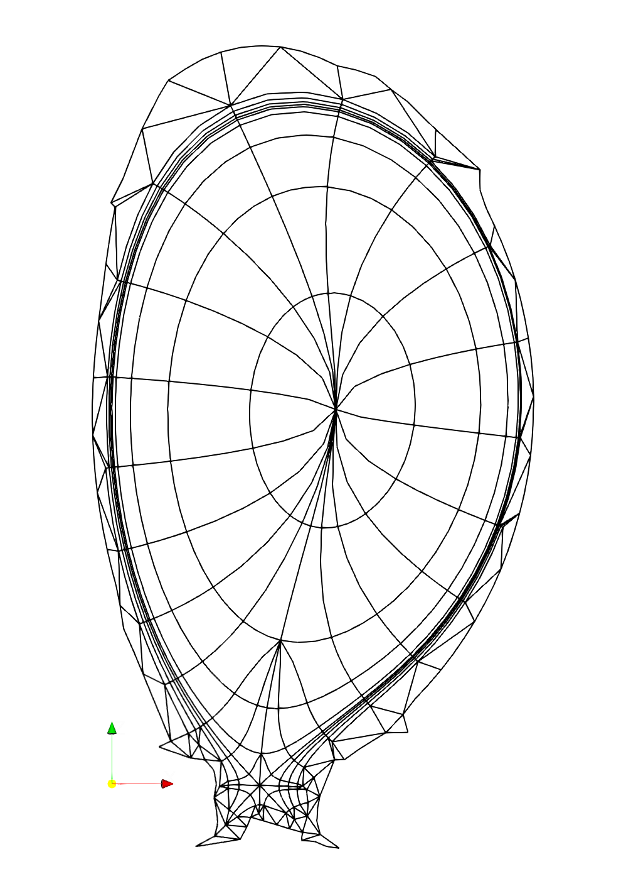
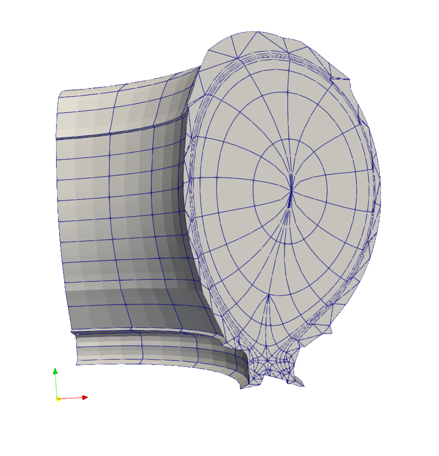
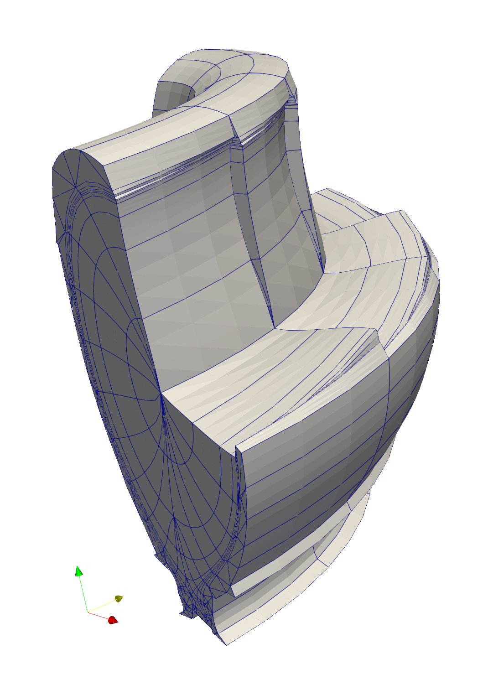

Meshes for Tokamaks
===================

Generating a realistic field-aligned mesh for a tokamak is
considerably more complicated. This is done using the
``fame-hypnotoad`` command and a G-EQDSK file containing data on the
equilibrium magnetic field being used for the mesh. This page
introduces how to use it. To find out more about the options
available, run ``fame--hypnotoad --help``.

Configuring a Poloidal Mesh with Hypnotoad
------------------------------------------

The first step is to create a poloidal mesh from which the 3D mesh can
be extruded. Most of the area of this mesh will be generated using
`hypnotoad <https://hypnotoad.readthedocs.io/en/latest/>`_, the mesh
generator for the `BOUT++ finite element code
<https://bout-dev.readthedocs.io/en/latest/index.html>`_.

Hypnotoad is configured using a YAML file with a number of
settings. You can experiment with settings and then write out such a
file using the ``hypnotoad-gui`` tool.

.. important::
   Do **not** tick the "Non-Orthogonal" option in the GUI. NESO-fame
   does not currently support non-orthogonal meshes.

Load a G-EQDSK file and then adjust the various parameters. Click
"Run" to see what the resulting mesh will look like on the plot to the
right. Note that this will include markers in the centre of an element
and on the segments between segments, not just at the corners. As
such, the plot will look artificially crowded.  Once you are happy
with the results, you can save your settings to a YAML file.

                 single-null equilibrium.

Settings for the Poloidal Mesh in fame
--------------------------------------

The resulting YAML file can be passed to ``fame-hypnotoad`` using the
``--config`` option. By default, NESO-fame will perform some
modifications on the poloidal mesh. Triangles will be added to fill in
the core. Any elements outside the tokamak vessel or too close to the
wall (decided according to ``--min-wall-distance``) will be
removed. The remaining space between the existing and the wall will be
filled with additional triangles.

By default the wall
will be included in the mesh exactly the way it is specified in the
G-EQDSK file. However, you will likely want to adjust the resolution
of the wall to be closer to that of the rest of the mesh. This can be
done with the ``--wall-resolution`` option, which takes a factor by
which to multiply the average length of the edges closest to the wall
in the hypnotoad-produced mesh. The wall will be divided into segments
as close to this size as possible, using interpolation. Sharp angles
in the wall will be preserved if they are above the
``--wall-angle-threshold``.

There are also some steps to clean up the mesh. Very narrow elements
radiating away from the X-point(s) towards the O-point will be merged
with their neighbours, to avoid over-resolving those areas. The
threshold ratio between the height and width of an element when this
happens can be controlled with ``--max-ratio``. Elements adjacent to  the
walls may be combined if they would otherwise self-intersect.

Before producing the whole 3D mesh it will likely be useful to examine
what the poloidal mesh looks like following the modifications
described above. You can do this by using the ``--poloidal`` argument
to ``fame-hypnotoad``. For example, the following command produces a
mesh like the one below::

  fame-hypnotoad --config mesh_settings.yml --min-wall-distance 0.5 \
                 --wall-resolution 1. --order 3 --poloidal \
                 eqdsk_data.g mesh.xml

Extruding the Mesh
------------------

NESO-fame will trace the vertices of the poloidal mesh into the
toroidal direction of the tokamak, to create a 3D mesh. By default a
full tokamak mesh will be produced, but it is possible to create only
a sector using the ``--toroidal-limits`` option. The toroidal
resolution can be set with the ``--n`` option and the number of
nonconformal layers with ``--layers``. By default the number of layers
will be the same as the toroidal resolution.

Vertices on the mesh generated by hypnotoad and in the core region
will follow magnetic field lines. Vertices in the triangles added next
to the tokamak wall will not follow field lines and maintain constant
R and Z values at all toroidal coordinates. The outermost vertices in
the hynpotoad-produced mesh will transition between these two
extremes, taking a weighted average. The number of steps to take
between full field-alignment and complete unalignment is set using
``--alignment-steps`` and defaults to 1. This means that the very
outermost vertices in the hypnotoad mesh will be a 50-50 mix between
field aligned and unaligned. Higher values would mean additional
vertices in the hypnotoad mesh, closer to the core, would have
intermediate degrees of field-alignment. A value of zero means that
all vertices within the hypnotoad mesh are fully field-aligned and
there is no transition.

In order to produce smaller file sizes, it is recommended you apply
the ``--compress`` flag. The only disadvantage of this is it makes it
more difficult to examine the output if there are problems.

An example command to produce a mesh and the :doc:`visualisation
<visualisation>` of the result can be seen below::

  fame-hypnotoad --config mesh_settings.yml --min-wall-distance 0.5 \
                 --wall-resolution 1. --order 3 \
                 --toroidal-limits 0. 1.570796327 --n 4 \
                 --alignment-setps 2 eqdsk_data.g mesh.xml

To see the way internal elements are field-aligned requires hiding
some of the external elements. This can be done using ParaView.

                 the field-alignment.
 
What to do About Negative Jacobians
-----------------------------------

When running ``FieldConvert``, it may complain of negative
Jacobians. NESO-fame is able to adjust the mesh to avoid most of
these, but sometimes they will arise in the region just outside the
portion of the mesh generated by hypnotoad. This happens in prism
elements that have a small poloidal cross-section where some edges
have a degree of field-alignment and others do not. In this situation,
it is possible for the element to self-intersect. A certain amount of
trial-and-error is required to overcome this. You can try:

* Increasing the number of non-conformal layers
* Increasing the number of alignment steps
* Changing the minimum distance between the hypnotoad mesh and the
  tokamak wall
